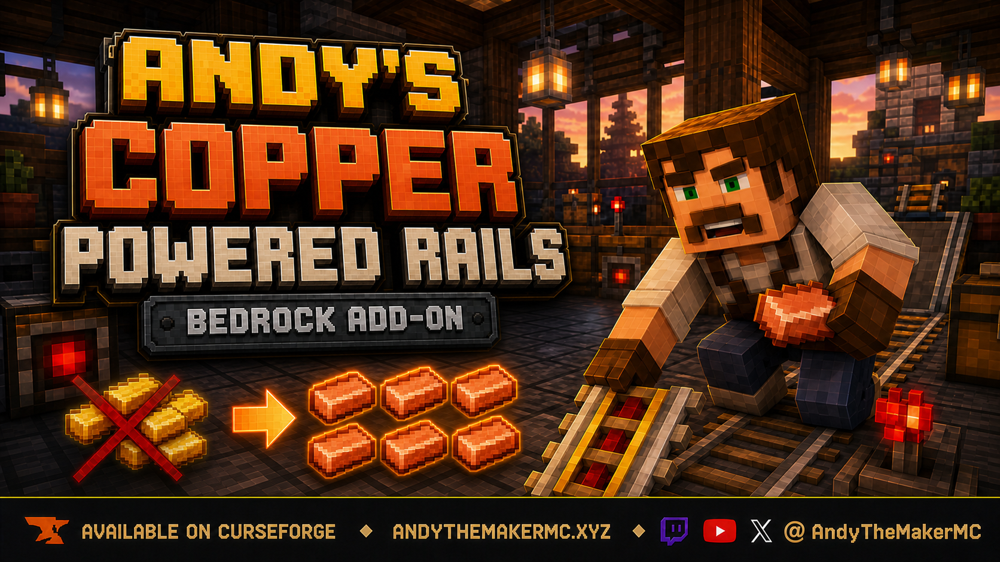
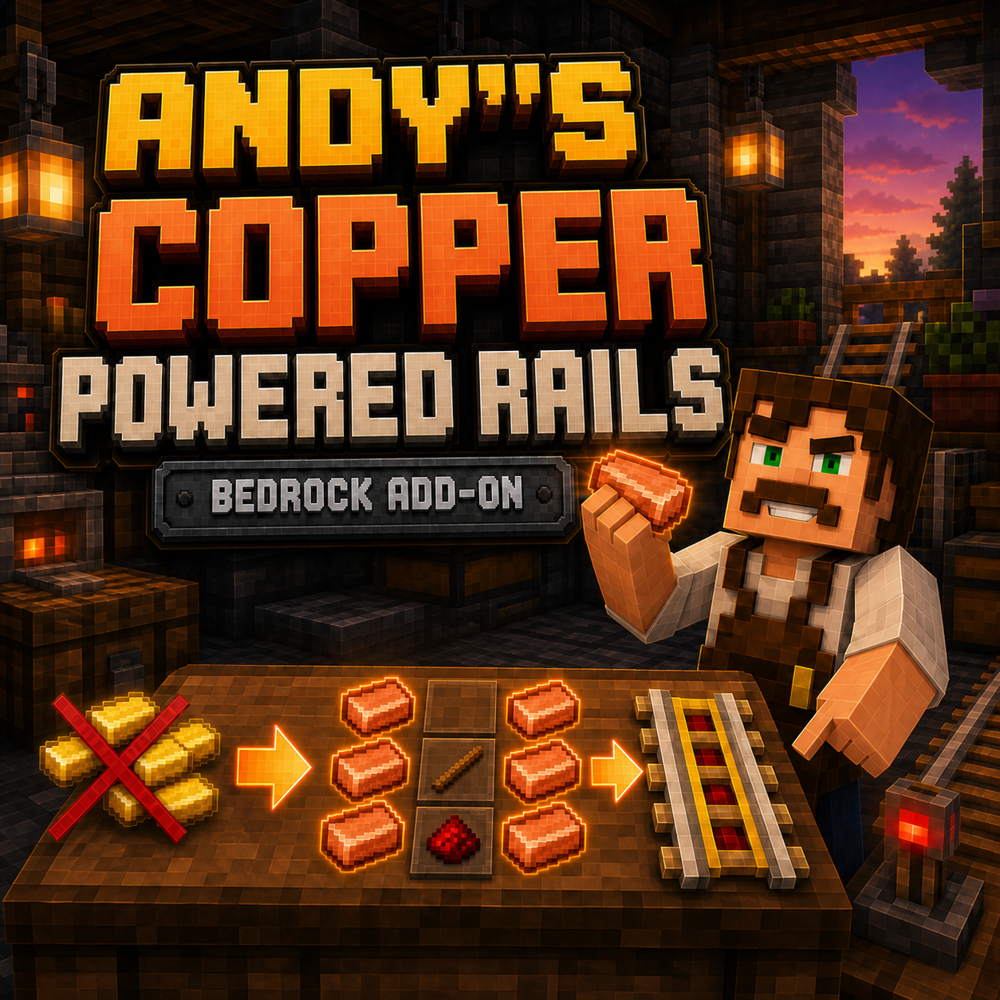

# Andy's Copper Powered Rails

> An early-game quality-of-life recipe rebalance for Minecraft Bedrock.

Powered rails are useful for survival railways, but their gold cost can make early networks an unnecessary grind. This official Andy The Maker add-on for Minecraft Bedrock replaces the six gold ingots in the vanilla powered-rail recipe with six copper ingots.

The rail's appearance, redstone behavior, minecart performance, recipe shape, and six-rail output stay vanilla. Only its crafting ingredients change.

## Download

- **Main download:** [CurseForge](https://www.curseforge.com/minecraft-bedrock/addons/andys-copper-powered-rails)
- **GitHub mirror:** [Andys_Copper_Powered_Rails_1.0.1.mcaddon](https://github.com/CharlesJGantt/andys-copper-powered-rails/raw/main/dist/Andys_Copper_Powered_Rails_1.0.1.mcaddon)

## Recipe

Craft six powered rails at a crafting table:

| Copper Ingot | *(empty)* | Copper Ingot |
| --- | --- | --- |
| Copper Ingot | Stick | Copper Ingot |
| Copper Ingot | Redstone Dust | Copper Ingot |

| Material | Amount |
| --- | ---: |
| Copper Ingot | 6 |
| Stick | 1 |
| Redstone Dust | 1 |

**Output:** 6 Powered Rails

## Why use it?

This is for players who want powered rails in the early game without hours of gold mining, a trip to the Nether just for gold, or a gold farm. Copper is abundant during ordinary Overworld progression, so practical minecart lines can arrive sooner without adding blocks, items, scripts, or new mechanics.

## Installation

1. Download the `.mcaddon` from [CurseForge](https://www.curseforge.com/minecraft-bedrock/addons/andys-copper-powered-rails), or use the [GitHub mirror](https://github.com/CharlesJGantt/andys-copper-powered-rails/raw/main/dist/Andys_Copper_Powered_Rails_1.0.1.mcaddon).
2. Open the file with Minecraft Bedrock and let the Behavior Pack import.
3. In the target world, open **Behavior Packs → My Packs** and activate **Andy's Copper Powered Rails [BP]**.

Minecraft Bedrock **26.0 or newer** is required. No resource pack, experiments, cheats, or dependencies are needed.

## Compatibility

- Single-player and multiplayer worlds
- Realms and compatible Bedrock servers
- Vanilla rail behavior

This add-on deliberately overrides the vanilla powered-rail recipe. If another behavior pack changes that same recipe, place the recipe you want higher in the world's Behavior Pack list. Ordinary rails, detector rails, and activator rails are unchanged because they do not use gold.

## Optional Andy The Maker lore

This is a standalone gameplay add-on—no lore knowledge is needed. The wider Andy The Maker setting has a separate workup on copper-powered rails at [AndyTheMakerMC.xyz](https://AndyTheMakerMC.xyz).

> **Bring the railway to your own world.** *Andy's Copper Powered Rails* is the official Andy The Maker-created add-on for Minecraft Bedrock. It provides the copper-powered-rail functionality associated with the Copperling railway article as a practical, standalone quality-of-life release—no lore knowledge required. [Get it on CurseForge.](https://www.curseforge.com/minecraft-bedrock/addons/andys-copper-powered-rails)

## Follow and support

Find add-ons, lore, tutorials, and videos at [AndyTheMakerMC.xyz](https://AndyTheMakerMC.xyz). Follow [@AndyTheMakerMC on YouTube](https://www.youtube.com/@AndyTheMakerMC), [Twitch](https://twitch.tv/AndyTheMakerMC), and [X](https://x.com/AndyTheMakerMC).

Support future add-ons through [Ko-fi](https://ko-fi.com/andythemakermc) or a [direct donation](https://buy.stripe.com/4gM4gz0qu0xwgxw0IfcMM00). Support is appreciated, never required.

## License and permitted use

**All Rights Reserved. Copyright © 2026 Andy / AndyTheMakerMC.**

Players may download the official, unmodified release from CurseForge, install and use it in personal or multiplayer worlds, Realms, and compatible Bedrock servers. Normal Minecraft world-pack delivery to players joining a world with the official add-on enabled is allowed.

Content creators may use the official, unmodified add-on in original videos, streams, screenshots, tutorials, reviews, showcases, articles, and social posts, including monetized work. Credit to AndyTheMakerMC and a link to the official CurseForge page are appreciated whenever practical.

You may not redistribute, reupload, rehost, mirror, resell, bundle, repackage, modify, translate, adapt, reverse engineer, decompile, disassemble, extract, or reuse the add-on, source code, documentation, branding, or artwork without prior written permission. Do not provide the add-on file as a separate download through a world download, server pack, modpack, or archive.

Minecraft is a trademark of Microsoft Corporation. This project is not affiliated with, endorsed by, sponsored by, or associated with Microsoft or Mojang Studios.
